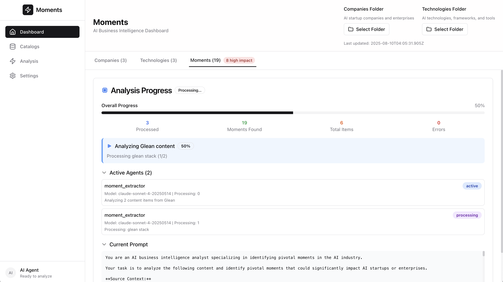

# Moments

<div align="center">
  
  
  **AI-Powered Business Intelligence for the AI Industry**
  
  Transform overwhelming AI industry information into clear, actionable insights with local-first intelligence and Claude Code SDK integration.

  [](https://www.typescriptlang.org/)
  [](https://nextjs.org/)
  [](https://docs.anthropic.com/en/docs/claude-code/sdk)
  [](https://opensource.org/licenses/MIT)
</div>

## 🚀 What is Moments?

**Moments** is a local-first, agent-driven application that discovers and analyzes pivotal moments in the AI business landscape. Built as an intelligent wrapper around the [Claude Code SDK](https://docs.anthropic.com/en/docs/claude-code/sdk), Moments transforms raw business content into classified intelligence through specialized AI agents.

### Key Features

- **🤖 Multi-Agent AI Analysis** - Specialized sub-agents for content analysis, classification, and correlation discovery
- **📊 Business Intelligence Dashboard** - Real-time analysis of AI startups, enterprises, and market dynamics  
- **🔒 Local-First Architecture** - Your data stays on your systems with optional AI enhancement
- **⚡ Real-Time Processing** - Live progress tracking and transparent AI agent activities
- **🎯 Factor Classification** - Automatic categorization by micro/macro business factors
- **🔗 Correlation Discovery** - AI-powered relationship mapping between market events

<div align="center">
  
  
</div>

## 🏗️ Architecture & Technology

Moments showcases modern AI-first application architecture with production-ready patterns:

### Multi-Agent System
```typescript
// Specialized AI agents for different analysis tasks
const subAgents = {
  contentAnalyzer: {    // Extract pivotal moments from content
    model: "claude-sonnet-4-20250514",
    temperature: 0.3
  },
  classificationAgent: { // Categorize by business factors
    model: "claude-sonnet-4-20250514", 
    temperature: 0.2
  },
  correlationEngine: {   // Discover relationships
    model: "claude-sonnet-4-20250514",
    temperature: 0.4
  }
}
```

### Technology Stack
- **Frontend**: Next.js 14+, React 18+, TypeScript 5+, Tailwind CSS, shadcn/ui
- **AI Integration**: Claude Code SDK, Anthropic API, multi-agent orchestration
- **State Management**: Zustand with localStorage persistence
- **Development**: ESLint, TypeScript, modern React patterns
- **Architecture**: 4-layer design (Presentation, Agent Orchestration, Data Processing, Storage)

## 🎯 Use Cases

### For Business Leaders
- **Investment Intelligence**: Track startup trajectories and acquisition targets
- **Competitive Analysis**: Monitor competitor moves 3-6 months before market impact
- **Strategic Planning**: Understand regulatory impacts on product roadmaps

### For Development Teams
- **Agent Orchestration**: Learn multi-agent AI application patterns
- **Claude Code SDK**: Explore production-ready AI integration techniques
- **TypeScript AI Apps**: Study type-safe AI development workflows

## 🚀 Quick Start

### Prerequisites
- Node.js 18+
- Anthropic API key
- 2GB free disk space

### Installation

```bash
# Clone the repository
git clone https://github.com/your-username/moments.git
cd moments

# Install dependencies
npm install

# Configure environment
cp .env.example .env.local
# Add your Anthropic API key to .env.local

# Start development server
npm run dev
```

Open [http://localhost:3000](http://localhost:3000) to see the application.

### Configuration

Create your `.env.local` file:

```env
# Required: Anthropic API key for AI analysis
NEXT_PUBLIC_ANTHROPIC_API_KEY=your_api_key_here
ANTHROPIC_API_KEY=your_api_key_here

# Optional: Custom configuration path
CONFIG_PATH=./config.yml
```

## 📖 Getting Started Guide

### 1. Load Content Catalogs


- Click **"Select Folder"** to choose your content directories
- Load the included `companies/` and `technologies/` folders
- Catalogs populate automatically with structured data
- Content persists across browser sessions

### 2. Analyze Moments

Switch to the **Moments** tab and click **"Analyze Moments"** to:
- Process content through AI agents
- Extract pivotal business moments
- Classify by micro/macro factors
- Generate correlation insights

### 3. Explore Intelligence

Use the intelligent interface to:
- **Filter by factors**: Company, competition, regulation, technology
- **Sort by impact**: High-impact moments surface first
- **Search content**: Find specific companies or technologies
- **Track confidence**: Understand AI analysis reliability

## 🧠 AI Analysis Features

### Factor Classification System

Moments categorizes business developments into:

**Micro Factors** (Company-Specific):
- 🏢 **Company**: Leadership, funding, product launches
- 🥊 **Competition**: Competitor moves, market positioning  
- 🤝 **Partners**: Strategic alliances, integrations
- 👥 **Customers**: Customer wins, market adoption

**Macro Factors** (Industry-Wide):
- 💰 **Economic**: Market conditions, investment trends
- 🌍 **Geo-Political**: Trade policies, international relations
- ⚖️ **Regulation**: Policy changes, compliance requirements
- 🔬 **Technology**: Breakthrough innovations, standards
- 🌱 **Environment**: Sustainability, ESG considerations
- ⛓️ **Supply Chain**: Infrastructure, resource availability

### Real-Time Processing



Monitor AI agent activities in real-time:
- **Content Analyzer**: Extracting moments from documents
- **Classification Agent**: Categorizing by business factors
- **Correlation Engine**: Discovering relationships
- **Progress Tracking**: Step-by-step analysis visibility

## 🧪 User Evaluation Guide

### Testing Enhanced Interactivity Features

The latest release includes comprehensive interactive features. Here's how to evaluate and test them:

#### 1. Enhanced Moment Cards

**What to Test:**
- **Expandable Information Display**: Click "Show More" on any moment card to reveal complete AI analysis
- **Classification Reasoning**: Expanded view shows why AI classified the moment with specific factors
- **Impact Analysis**: Detailed reasoning for impact scores (0-100 scale)
- **Content Extracts**: Full text snippets that triggered moment detection

**Evaluation Criteria:**
- ✅ Cards expand smoothly with additional information
- ✅ All agent response data is displayed (reasoning, impact analysis, content)
- ✅ "Show More/Less" buttons work correctly
- ✅ Information is well-organized and readable

#### 2. Interactive Keyword Filtering

**What to Test:**
- **Clickable Keywords**: Click any keyword badge in moment cards
- **Search Integration**: Keywords should automatically add to search filter
- **Visual Feedback**: Keywords show filter icons and hover states
- **Multiple Keywords**: Add multiple keywords to build complex filters

**How to Test:**
1. Navigate to Moments tab and run analysis
2. Find moment cards with keywords in "Key Terms" section
3. Click different keywords and observe search field updates
4. Combine multiple keyword clicks for advanced filtering

**Evaluation Criteria:**
- ✅ Keywords are visually distinguishable as clickable elements
- ✅ Clicking keywords adds them to search immediately
- ✅ Search results update in real-time
- ✅ Multiple keywords can be combined effectively

#### 3. Entity Navigation System

**What to Test:**
- **Company Links**: Click company names in moment cards
- **Technology Links**: Click technology names in moment cards  
- **Catalog Matching**: Test with both existing and non-existing entities
- **Navigation Flow**: Verify smooth transitions to detail views

**Test Scenarios:**
1. **Existing Entities**: Click "Glean" or "Sierra AI" in moments (should navigate to company details)
2. **Technology Entities**: Click "Claude Code" or "LLM Agents" (should navigate to technology details)
3. **Non-existing Entities**: Click entities not in catalogs (should show appropriate handling)

**Evaluation Criteria:**
- ✅ Company and technology names show external link icons
- ✅ Clicking navigates to appropriate catalog detail views
- ✅ Non-existing entities are handled gracefully
- ✅ Navigation maintains proper context

#### 4. Catalog Detail Views

**What to Test:**
- **Three-Tab Interface**: Overview, Content, Moments tabs
- **AI Insights**: Statistics and intelligence derived from related moments
- **Content Display**: File listings with previews and metadata
- **Related Moments**: Moments connected to the selected catalog item

**Test Navigation:**
1. Go to Companies or Technologies tab
2. Click any catalog card to open detail view
3. Navigate through all three tabs (Overview, Content, Moments)
4. Test "Back" button functionality
5. Try clicking entities within related moments for nested navigation

**Evaluation Criteria:**
- ✅ Detail view opens with proper catalog item information
- ✅ All three tabs load correctly with appropriate content
- ✅ AI insights show meaningful statistics and factors
- ✅ Related moments are accurately identified and displayed
- ✅ Navigation between catalog and detail views works smoothly

#### 5. Clickable Catalog Cards

**What to Test:**
- **Visual Feedback**: Hover states and click animations
- **Detail Navigation**: Cards open appropriate detail views
- **Consistent Behavior**: Both company and technology cards work identically

**Evaluation Steps:**
1. Navigate to Companies tab
2. Hover over catalog cards (should show visual feedback)
3. Click cards to open detail views
4. Repeat with Technologies tab
5. Test navigation back to catalog views

**Evaluation Criteria:**
- ✅ Cards show clear hover states indicating they're clickable
- ✅ Clicking opens detail view for the correct catalog item
- ✅ Consistent behavior across different catalog types
- ✅ Smooth visual transitions

#### 6. End-to-End Workflow Testing

**Complete User Journey:**
1. **Start**: Load catalogs using folder selection
2. **Analyze**: Run moment analysis and wait for completion
3. **Explore Moments**: Use filters, search, and sorting
4. **Keyword Interaction**: Click keywords to filter content
5. **Entity Navigation**: Click companies/technologies in moments
6. **Detail Exploration**: Navigate through catalog detail tabs
7. **Correlation Discovery**: Find related moments in detail views

**Success Indicators:**
- ✅ Seamless flow from catalog loading to detailed analysis
- ✅ All interactive elements respond appropriately
- ✅ Information remains consistent across different views
- ✅ Navigation context is preserved throughout the journey

### Performance Evaluation

**Expected Behavior:**
- Moment cards expand/collapse smoothly (< 300ms animation)
- Entity clicks navigate immediately (< 100ms response)
- Detail views load efficiently (< 500ms for local data)
- Search filtering updates in real-time (< 50ms)

### Troubleshooting Common Issues

**Keywords Not Clickable:**
- Verify moments were analyzed successfully
- Check that moment cards have expanded details visible
- Ensure keywords array is populated in moment data

**Entity Navigation Not Working:**
- Confirm catalog data is loaded properly
- Check browser console for navigation errors
- Verify entity names match catalog entries

**Detail Views Not Loading:**
- Ensure catalog items have proper data structure
- Check that moments store contains analyzed moments
- Verify navigation state management

### Reporting Issues

When testing, please note:
- Browser and version used
- Specific user actions that caused issues
- Console error messages (if any)
- Expected vs actual behavior

This enhanced interactivity transforms Moments from a static dashboard into a fully interactive business intelligence platform for AI industry analysis.

### Testing Data Persistence & Recovery Features

The latest update includes robust data persistence and recovery mechanisms to ensure your catalogs and moments data remain available across browser sessions.

#### 7. Storage Management System

**What to Test:**
- **Storage Health Monitor**: Check available storage space and health status
- **Backup/Restore**: Export and import complete application state
- **Auto-Recovery**: Automatic data restoration on app startup
- **Storage Inspection**: Debug and monitor stored data

**How to Access:**
1. Click the settings/cog icon in the header (next to folder selection)
2. Storage Manager panel expands with complete storage controls

**Storage Manager Features:**
- **Health Status**: Green checkmark = healthy, Red warning = issues
- **Space Usage**: Shows KB used and percentage of available storage
- **Current State**: Displays loaded companies, technologies, and moments counts
- **Backup Button**: Downloads complete state as JSON file
- **Restore Button**: Upload previous backup to restore state
- **Inspect Button**: Logs detailed storage info to browser console
- **Check Health**: Re-runs storage diagnostics
- **Refresh Page**: Force reload with fresh hydration
- **Clear All**: Remove all stored data (with confirmation)

**Evaluation Criteria:**
- ✅ Storage health shows accurate status and metrics
- ✅ Backup creates downloadable JSON with timestamp
- ✅ Restore successfully loads previous state from backup
- ✅ Storage persists after closing/reopening browser
- ✅ Auto-recovery status badge shows in header

#### 8. Data Persistence Testing

**Test Scenarios:**

**Scenario 1: Basic Persistence**
1. Load catalogs and generate moments
2. Note the counts (e.g., 3 companies, 3 technologies, 20 moments)
3. Close browser completely
4. Reopen browser and navigate to app
5. Verify all data is restored automatically

**Scenario 2: Extended Session**
1. Load data and generate moments
2. Leave browser open for 8+ hours or overnight
3. Return to app and verify data still present
4. If missing, check auto-recovery status in header

**Scenario 3: Backup and Restore**
1. Create full dataset with catalogs and moments
2. Click Storage Manager → Backup
3. Save the JSON file
4. Clear all data using "Clear All" button
5. Restore from backup file
6. Verify complete restoration

**Scenario 4: Auto-Recovery**
1. Load catalogs (but don't generate moments)
2. Close browser
3. Reopen and watch for recovery status badge
4. Should show "Rehydrating catalogs..." then "Recovery complete"
5. Verify catalogs are restored

**Expected Behavior:**
- Data persists indefinitely until manually cleared
- Auto-recovery runs within 500ms of app load
- Recovery status shows in header during process
- Corrupted data is automatically cleared and reported
- Version tracking enables future migrations

#### 9. Storage Debugging

**Console Commands for Debugging:**

Open browser console (F12) and run:
```javascript
// Inspect all stored data
localStorage.getItem('moments-catalog-store')
localStorage.getItem('moments-store')

// Check storage size
new Blob(Object.values(localStorage)).size
```

**Common Issues and Solutions:**

**Issue: Data disappears after session**
- Check browser privacy settings (disable "Clear on exit")
- Verify localStorage is not blocked
- Check Storage Manager health status
- Try backup/restore as workaround

**Issue: Auto-recovery not working**
- Check recovery status badge in header
- Open console for detailed recovery logs
- Verify folder paths still exist
- Use Storage Manager to manually reload

**Issue: Storage quota exceeded**
- Check Storage Manager for space usage
- Clear old moments before generating new ones
- Use backup to save important data externally
- Consider using multiple browser profiles

**Performance Metrics:**
- Storage operations: < 100ms
- Auto-recovery: < 2s on app startup
- Backup/restore: < 500ms for typical datasets
- Health check: < 50ms response time

## 🔧 Configuration

### Custom Content Sources

Modify `config.yml` to analyze your own content:

```yaml
catalogs:
  companies:
    name: "Companies"
    description: "AI Companies and Startups"
    source_folder: "./companies"
    file_patterns: ["**/*.md", "**/*.txt"]
  
  technologies:
    name: "Technologies" 
    description: "AI Technologies and Frameworks"
    source_folder: "./technologies"
    file_patterns: ["**/*.md", "**/*.txt"]
```

### Agent Configuration

Customize AI agent behavior:

```yaml
agents:
  content_analyzer:
    enabled: true
    model: "claude-sonnet-4-20250514"
    temperature: 0.3
    
  classification_agent:
    model: "claude-sonnet-4-20250514"
    temperature: 0.2
```

## 📊 Sample Data

The repository includes curated content for exploration:

### Companies
- **Glean**: Agent platform and enterprise search
- **Sierra AI**: Conversational agent operating system
- **Walmart**: Enterprise AI strategy and implementation

### Technologies
- **Claude Code**: AI development tools and SDK
- **LLM Agents**: Multi-agent system architectures
- **LLM Prompting**: Advanced prompting techniques

## 🏗️ Development

### Project Structure

```
src/
├── app/                    # Next.js App Router
├── components/            # React components
│   ├── ui/               # shadcn/ui components
│   ├── moment-card.tsx   # AI moment display
│   └── moments-view.tsx  # Analysis dashboard
├── lib/                  # Core logic
│   ├── moment-extractor.ts  # AI content analysis
│   ├── sub-agents.ts        # Agent orchestration
│   └── factor-classifier.ts # Business factor logic
├── store/                # State management
└── types/                # TypeScript definitions
```

### Key Components

- **MomentExtractor**: Claude Code SDK integration for content analysis
- **SubAgentManager**: Multi-agent orchestration and workflow
- **FactorClassifier**: Business intelligence classification logic
- **MomentsStore**: Zustand state management with persistence

### Development Commands

```bash
npm run dev          # Start development server
npm run build        # Production build
npm run type-check   # TypeScript validation
npm run lint         # Code linting
```

## 🔐 Security & Privacy

### Local-First Design
- All sensitive processing happens locally
- No cloud dependencies for core functionality
- Optional AI enhancement with your API keys

### Development vs Production
- **Development**: Client-side API keys for rapid iteration
- **Production**: Server-side API routes recommended
- **Migration Path**: Built-in patterns for secure deployment

## 📚 Learning Resources

### Documentation
- **[Architecture Specification](specs/stack.md)**: Complete technical architecture
- **[Design System](specs/design.md)**: UI/UX design principles
- **[Development Guide](CLAUDE.md)**: Comprehensive development instructions

### Blog Posts
- **[AI Business Intelligence](blog/end-user-persona-ai-business-intelligence.md)**: End-user perspective
- **[Claude Code SDK Architecture](blog/developer-persona-claude-code-sdk-architecture.md)**: Technical deep dive
- **[AI Engineer Guide](blog/ai-engineer-persona-multi-agent-systems.md)**: Multi-agent systems

## 🤝 Contributing

We welcome contributions! Areas of interest:

### High Priority
- **Server-side API migration** for production security
- **Additional data sources** (RSS, APIs, databases)
- **Advanced correlation algorithms** for business intelligence
- **Export capabilities** (PDF reports, CSV data)

### Development Setup

1. Fork the repository
2. Create feature branch: `git checkout -b feature/amazing-feature`
3. Make changes following existing patterns
4. Add tests for new functionality
5. Submit pull request with detailed description

### Code Style
- TypeScript-first development
- Feature-slice approach (no mocks/prototypes)
- AI-native patterns with Claude Code SDK
- Modern React and Next.js conventions

## 🚀 Roadmap

### Immediate (Next Release)
- [ ] Server-side API routes for production security
- [ ] Enhanced correlation discovery algorithms
- [ ] Export functionality (reports, data)
- [ ] Additional content source integrations

### Short Term
- [ ] Advanced filtering and search capabilities
- [ ] Custom agent configuration UI
- [ ] Real-time content monitoring
- [ ] Team collaboration features

### Long Term
- [ ] Enterprise deployment options
- [ ] Advanced analytics and reporting
- [ ] Integration with business intelligence platforms
- [ ] Multi-language content analysis

## 📄 License

This project is licensed under the MIT License - see the [LICENSE](LICENSE) file for details.

## 🙏 Acknowledgments

- **[Anthropic](https://anthropic.com)** for Claude Code SDK and AI capabilities
- **[Vercel](https://vercel.com)** for Next.js framework and development tools
- **[shadcn/ui](https://ui.shadcn.com)** for beautiful, accessible components
- **AI research community** for multi-agent system patterns and techniques

---

<div align="center">
  <strong>Built with ❤️ using Claude Code SDK</strong>
  <br>
  <em>Transform information overload into strategic advantage</em>
</div>