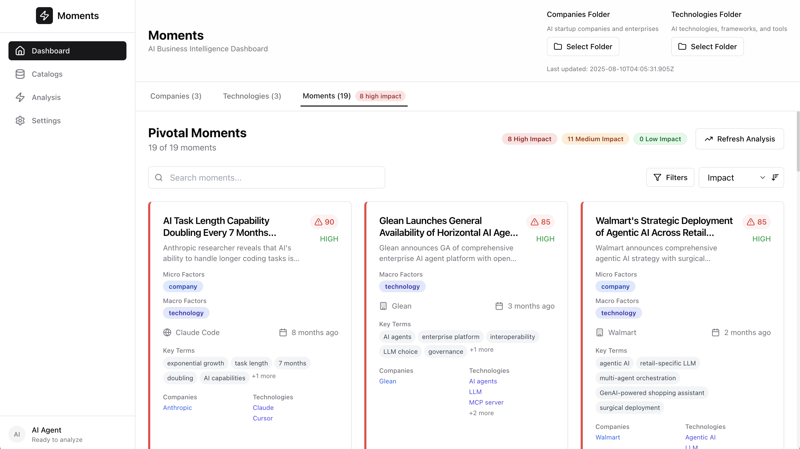
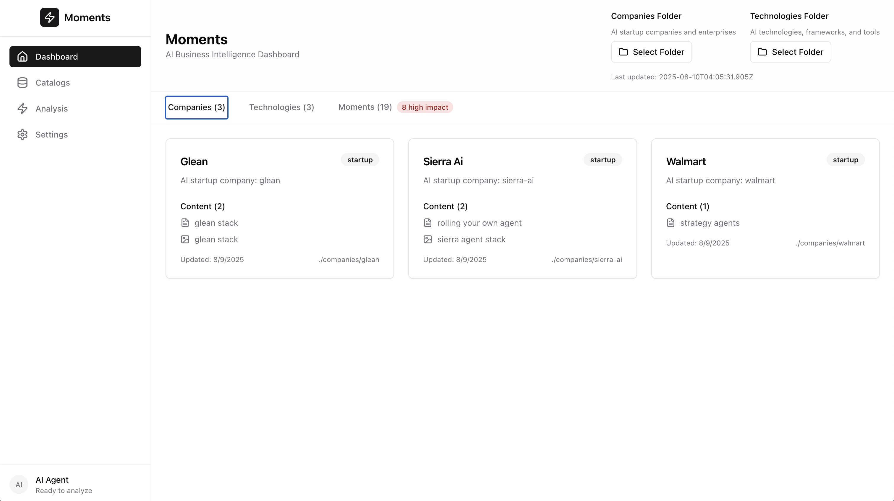
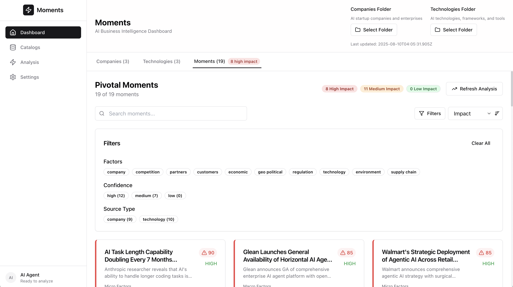
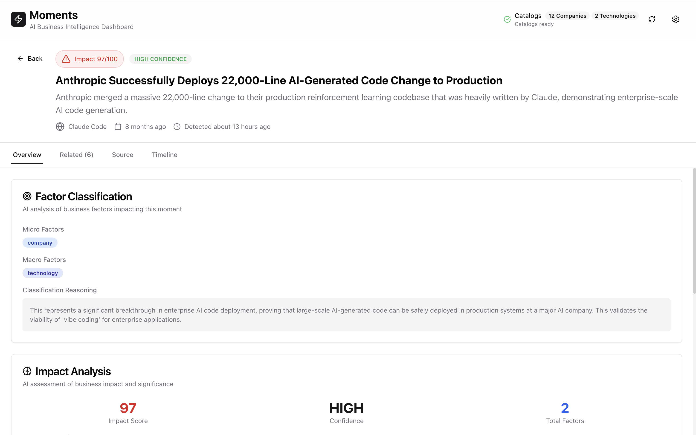
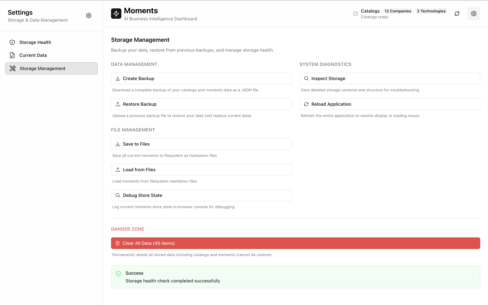

# Moments

<div align="center">
  
  
  **AI-Powered Business Intelligence for the AI Industry**
  
  Transform overwhelming AI industry information into clear, actionable insights with local-first intelligence and Claude Code SDK integration.

  [](https://www.typescriptlang.org/)
  [](https://nextjs.org/)
  [](https://docs.anthropic.com/en/docs/claude-code/sdk)
  [](https://opensource.org/licenses/MIT)
</div>

## 🚀 What is Moments?

**Moments** is a local-first, agent-driven application that discovers and analyzes pivotal moments in the AI business landscape. Built as an intelligent wrapper around the [Claude Code SDK](https://docs.anthropic.com/en/docs/claude-code/sdk), Moments transforms raw business content into classified intelligence through specialized AI agents.

### Key Features

- **🤖 Multi-Agent AI Analysis** - Specialized sub-agents for content analysis, classification, and correlation discovery
- **📊 Business Intelligence Dashboard** - Real-time analysis of AI startups, enterprises, and market dynamics  
- **🔒 Local-First Architecture** - Your data stays on your systems with optional AI enhancement
- **⚡ Smart Update System** - Incremental analysis processes only changed content for 10x faster updates
- **🎯 Factor Classification** - Automatic categorization by micro/macro business factors
- **🔗 Correlation Discovery** - AI-powered relationship mapping between market events
- **🗂️ File-System Integration** - Two-way sync with human-readable markdown files
- **📱 Apple Settings-Style Interface** - Professional, intuitive design with advanced storage management

<div align="center">
  
  
</div>

## 🏗️ Architecture & Technology

Moments showcases modern AI-first application architecture with production-ready patterns:

### Multi-Agent System
```typescript
// Specialized AI agents for different analysis tasks
const subAgents = {
  contentAnalyzer: {    // Extract pivotal moments from content
    model: "claude-sonnet-4-20250514",
    temperature: 0.3
  },
  classificationAgent: { // Categorize by business factors
    model: "claude-sonnet-4-20250514", 
    temperature: 0.2
  },
  correlationEngine: {   // Discover relationships
    model: "claude-sonnet-4-20250514",
    temperature: 0.4
  }
}
```

### Technology Stack
- **Frontend**: Next.js 14+, React 18+, TypeScript 5+, Tailwind CSS, shadcn/ui
- **AI Integration**: Claude Code SDK, Anthropic API, multi-agent orchestration
- **State Management**: Zustand with file-system persistence
- **Development**: ESLint, TypeScript, modern React patterns
- **Architecture**: 4-layer design (Presentation, Agent Orchestration, Data Processing, Storage)

## 🎯 Use Cases

### For Business Leaders
- **Investment Intelligence**: Track startup trajectories and acquisition targets
- **Competitive Analysis**: Monitor competitor moves 3-6 months before market impact
- **Strategic Planning**: Understand regulatory impacts on product roadmaps

### For Development Teams
- **Agent Orchestration**: Learn multi-agent AI application patterns
- **Claude Code SDK**: Explore production-ready AI integration techniques
- **TypeScript AI Apps**: Study type-safe AI development workflows

## 🚀 Quick Start

### Prerequisites
- Node.js 18+
- Anthropic API key
- 2GB free disk space

### Installation

```bash
# Clone the repository
git clone https://github.com/your-username/moments.git
cd moments

# Install dependencies
npm install

# Configure environment
cp .env.example .env.local
# Add your Anthropic API key to .env.local

# Start development server
npm run dev
```

Open [http://localhost:3000](http://localhost:3000) to see the application.

### Configuration

Create your `.env.local` file:

```env
# Required: Anthropic API key for AI analysis
NEXT_PUBLIC_ANTHROPIC_API_KEY=your_api_key_here
ANTHROPIC_API_KEY=your_api_key_here

# Optional: Custom configuration path
CONFIG_PATH=./config.yml
```

## 📖 Getting Started Guide

### 1. Zero-Configuration Setup


- **Automatic Loading**: Catalogs load automatically from `companies/` and `technologies/` folders
- **Immediate Start**: App begins loading content on first visit
- **Real-Time Progress**: Watch analysis progress with live moment counting
- **File-System Integration**: Content persists as human-readable markdown files
- **Manual Refresh**: Use refresh buttons for manual content updates

### 2. Smart Analysis System

Switch to the **Moments** tab for AI-powered analysis:
- **Smart Update**: Process only new or changed content (90% faster)
- **Full Analysis**: Complete re-analysis of all content
- **Real-Time Progress**: Track moment discovery as it happens
- **Parallel Processing**: Multiple agents working simultaneously

### 3. Explore Intelligence



Navigate the comprehensive interface:
- **Filter by Factors**: Company, competition, regulation, technology
- **Sort by Impact**: High-impact moments surface first
- **Interactive Keywords**: Click keywords to filter instantly  
- **Deep Dive Details**: Click any moment for comprehensive analysis
- **Entity Navigation**: Click companies/technologies to explore connections

## 🧠 AI Analysis Features

### Factor Classification System

Moments categorizes business developments into:

**Micro Factors** (Company-Specific):
- 🏢 **Company**: Leadership, funding, product launches
- 🥊 **Competition**: Competitor moves, market positioning  
- 🤝 **Partners**: Strategic alliances, integrations
- 👥 **Customers**: Customer wins, market adoption

**Macro Factors** (Industry-Wide):
- 💰 **Economic**: Market conditions, investment trends
- 🌍 **Geo-Political**: Trade policies, international relations
- ⚖️ **Regulation**: Policy changes, compliance requirements
- 🔬 **Technology**: Breakthrough innovations, standards
- 🌱 **Environment**: Sustainability, ESG considerations
- ⛓️ **Supply Chain**: Infrastructure, resource availability

### Real-Time Processing



Monitor AI agent activities in real-time:
- **Content Analyzer**: Extracting moments from documents
- **Classification Agent**: Categorizing by business factors
- **Correlation Engine**: Discovering relationships
- **Progress Intelligence**: Step-by-step analysis visibility with live counts

### Advanced Storage Management

Professional storage system with Apple Settings-style interface:
- **Health Monitoring**: Real-time storage capacity and performance metrics
- **File Integration**: Two-way sync between app and filesystem
- **Backup & Restore**: Complete data export/import capabilities
- **Auto-Recovery**: Automatic data restoration on app restart

## 🧪 Performance Features

### Intelligent Processing
- **Smart Updates**: 90% faster processing by analyzing only changed content
- **Parallel Agents**: Multiple AI agents working simultaneously
- **Incremental Cache**: Tracks content changes using MD5 hashing
- **Temporal Windows**: Correlation analysis within configurable time periods (14 days)

### File-System First Architecture
- **Human-Readable**: All data stored as markdown files with YAML frontmatter
- **Version Control**: Compatible with git for team collaboration
- **Local-First**: No vendor lock-in, your data stays with you
- **Performance**: Intelligent caching for immediate UI response

## 🔧 Configuration

### Custom Content Sources

Modify `config.yml` to analyze your own content:

```yaml
catalogs:
  companies:
    name: "Companies"
    description: "AI Companies and Startups"
    source_folder: "./companies"
    file_patterns: ["**/*.md", "**/*.txt"]
  
  technologies:
    name: "Technologies" 
    description: "AI Technologies and Frameworks"
    source_folder: "./technologies"
    file_patterns: ["**/*.md", "**/*.txt"]
```

### Agent Configuration

Customize AI agent behavior:

```yaml
agents:
  content_analyzer:
    enabled: true
    model: "claude-sonnet-4-20250514"
    temperature: 0.3
    
  classification_agent:
    model: "claude-sonnet-4-20250514"
    temperature: 0.2
```

### Performance Settings

```yaml
app:
  processing:
    parallel_processing:
      enabled: true
      max_concurrent_sources: 4
      max_concurrent_content_per_source: 3
      enable_sub_agent_parallelization: true
```

## 📊 Sample Data

The repository includes curated content for exploration:

### Companies
- **Glean**: Agent platform and enterprise search
- **Sierra AI**: Conversational agent operating system
- **Walmart**: Enterprise AI strategy and implementation

### Technologies
- **Claude Code**: AI development tools and SDK
- **LLM Agents**: Multi-agent system architectures
- **LLM Prompting**: Advanced prompting techniques

## 🏗️ Development

### Project Structure

```
src/
├── app/                    # Next.js App Router
├── components/            # React components
│   ├── ui/               # shadcn/ui components
│   ├── moment-card.tsx   # AI moment display
│   └── moments-view.tsx  # Analysis dashboard
├── lib/                  # Core logic
│   ├── moment-extractor.ts  # AI content analysis
│   ├── sub-agents.ts        # Agent orchestration
│   └── factor-classifier.ts # Business factor logic
├── store/                # State management
└── types/                # TypeScript definitions
```

### Key Components

- **MomentExtractor**: Claude Code SDK integration for content analysis
- **SubAgentManager**: Multi-agent orchestration and workflow
- **IncrementalMomentManager**: Smart change detection and processing
- **MomentsStore**: Zustand state management with file persistence

### Development Commands

```bash
npm run dev          # Start development server
npm run build        # Production build
npm run type-check   # TypeScript validation
npm run lint         # Code linting
```

## 🔐 Security & Privacy

### Local-First Design
- All sensitive processing happens locally
- No cloud dependencies for core functionality
- Optional AI enhancement with your API keys

### Development vs Production
- **Development**: Client-side API keys for rapid iteration
- **Production**: Server-side API routes recommended
- **Migration Path**: Built-in patterns for secure deployment

## 📚 Learning Resources

### Documentation
- **[Architecture Specification](specs/stack.md)**: Complete technical architecture
- **[Design System](specs/design.md)**: UI/UX design principles
- **[Development Guide](CLAUDE.md)**: Comprehensive development instructions

### Blog Posts
- **[AI Business Intelligence](blog/end-user-persona-ai-business-intelligence.md)**: End-user perspective
- **[Claude Code SDK Architecture](blog/developer-persona-claude-code-sdk-architecture.md)**: Technical deep dive
- **[File-System AI Integration](blog/file-system-persistence-real-time-ai.md)**: Local-first architecture
- **[Parallel AI Processing](blog/parallel-ai-processing-performance.md)**: Performance optimization

## ✅ User Evaluation Guide

This guide helps you systematically evaluate the completed features and capabilities of the Moments application.

### 🚀 Initial Setup Evaluation

**Test Auto-Hydration System**
1. **Fresh Install Test**: 
   - Start the app for the first time
   - ✅ **Expected**: Automatic loading of companies and technologies from folders
   - ✅ **Verify**: Progress indicators show catalog loading status
   - ✅ **Check**: Companies and Technologies tabs show actual content counts

2. **Configuration Validation**:
   - Review `config.yml` file settings
   - ✅ **Expected**: Configurable folder paths and file patterns
   - ✅ **Verify**: App respects configuration settings for source folders

### 🧠 AI Analysis Features Evaluation

**Test Multi-Agent Analysis System**
1. **Smart Update Analysis**:
   - Navigate to Moments tab
   - Click "Smart Update" button
   - ✅ **Expected**: Real-time progress with moment count updates
   - ✅ **Verify**: Live agent activity tracking shows specialized sub-agents working
   - ✅ **Check**: Progress shows incrementing moment counts during processing

2. **Full Analysis Capability**:
   - Click "Analyze All" button
   - ✅ **Expected**: Complete analysis of all content with progress tracking
   - ✅ **Verify**: Parallel processing of multiple sources simultaneously
   - ✅ **Check**: Final moment cards appear automatically after completion

3. **Factor Classification Validation**:
   - Review generated moment cards
   - ✅ **Expected**: Color-coded factor badges (micro: company, competition, partners, customers)
   - ✅ **Verify**: Macro factor classification (economic, geo-political, regulation, technology, etc.)
   - ✅ **Check**: Impact scoring (High/Medium/Low) with confidence indicators

### 🎯 Interactive Features Evaluation

**Test Navigation and Interactivity**
1. **Entity Navigation**:
   - Click company/technology names in moment cards
   - ✅ **Expected**: Navigation to detailed catalog entries
   - ✅ **Verify**: Fallback to catalog tab when no match found
   - ✅ **Check**: Detail views show Overview, Content, and Moments tabs

2. **Keyword Filtering**:
   - Click keyword badges in moment cards
   - ✅ **Expected**: Instant filtering by selected keywords
   - ✅ **Verify**: Filter count updates in header (e.g., "16 of 80 moments (filtered)")
   - ✅ **Check**: All statistics badges reflect filtered results

3. **Moment Detail Views**:
   - Click on moment card titles or content areas
   - ✅ **Expected**: Comprehensive detail view with 4 tabs (Overview, Related, Source, Timeline)
   - ✅ **Verify**: Related moments show correlation scores and reasoning
   - ✅ **Check**: Source tab displays original content and metadata

### 📊 Storage and Persistence Evaluation

**Test File-System Integration**
1. **Two-Way File Persistence**:
   - Run analysis to generate moments
   - ✅ **Expected**: Moment files appear in `moments/` folder as markdown
   - ✅ **Verify**: Human-readable format with YAML frontmatter metadata
   - ✅ **Check**: App can reload moments from files on restart

2. **Storage Management Interface**:
   - Open Settings sidebar (gear icon in header)
   - Navigate through Storage Health, Current Data, Storage Management sections
   - ✅ **Expected**: Apple Settings-style interface with clear section organization
   - ✅ **Verify**: Real-time storage metrics and file system status
   - ✅ **Check**: Backup/restore functionality with file validation

3. **Auto-Recovery System**:
   - Restart the application
   - ✅ **Expected**: Automatic data recovery from file system
   - ✅ **Verify**: No need to manually reload catalogs or moments
   - ✅ **Check**: Status indicators confirm successful recovery

### ⚡ Performance Features Evaluation

**Test Intelligent Processing**
1. **Incremental Analysis Efficiency**:
   - Make small content changes to a company file
   - Run "Smart Update"
   - ✅ **Expected**: Significantly faster processing (90% time reduction)
   - ✅ **Verify**: Only changed content gets reprocessed
   - ✅ **Check**: Existing moments remain unchanged unless affected

2. **Parallel Processing Validation**:
   - Monitor agent activity during full analysis
   - ✅ **Expected**: Multiple agents working simultaneously
   - ✅ **Verify**: Progress shows concurrent processing of companies and technologies
   - ✅ **Check**: System utilizes configured parallelization settings from config.yml

3. **Real-Time Progress Intelligence**:
   - Watch progress during long analyses
   - ✅ **Expected**: Live moment counting instead of "0 moments found" until completion
   - ✅ **Verify**: Step-by-step progress with descriptive status messages
   - ✅ **Check**: Agent activity shows current processing stages

### 🎨 UI/UX Features Evaluation

**Test Interface Design and Usability**
1. **Professional Interface**:
   - Navigate through all main tabs (Companies, Technologies, Moments)
   - ✅ **Expected**: Consistent Apple Settings-style design
   - ✅ **Verify**: Smooth animations and hover states
   - ✅ **Check**: Responsive layout on different screen sizes

2. **Search and Filtering**:
   - Use search functionality in moments view
   - ✅ **Expected**: Real-time filtering with live count updates
   - ✅ **Verify**: Filter statistics reflect only filtered results
   - ✅ **Check**: Multiple filter types work together (keywords, factors, impact)

3. **Scrolling and Navigation**:
   - Scroll through long lists of cards
   - ✅ **Expected**: Smooth scrolling without UI freezing
   - ✅ **Verify**: All content accessible even when below the fold
   - ✅ **Check**: Navigation breadcrumbs work correctly in detail views

### 🔄 Data Refresh and Consistency

**Test Real-Time Data Management**
1. **Refresh Functionality Validation**:
   - Test all refresh buttons (header catalog refresh, moments reload)
   - ✅ **Expected**: Clear labeling distinguishes reload vs analysis operations
   - ✅ **Verify**: Tooltips explain what each refresh button does
   - ✅ **Check**: Auto-refresh after analysis ensures immediate visibility

2. **Data Consistency Checks**:
   - Compare moment cards with generated markdown files
   - ✅ **Expected**: Perfect consistency between UI and file system
   - ✅ **Verify**: All metadata and classifications match
   - ✅ **Check**: File timestamps reflect actual processing times

### 🎯 End-to-End Workflow Validation

**Complete User Journey Test**
1. **New User Experience**:
   - Simulate first-time user workflow
   - ✅ **Expected**: Zero configuration required, automatic content discovery
   - ✅ **Verify**: Intuitive progression from catalog loading to analysis
   - ✅ **Check**: Help text and status indicators guide user journey

2. **Power User Features**:
   - Test advanced features like correlation discovery and entity navigation
   - ✅ **Expected**: Rich interactivity reveals deep insights
   - ✅ **Verify**: Professional-grade business intelligence capabilities
   - ✅ **Check**: Export and backup features work for data preservation

### 📈 Success Criteria

**Overall Application Health**
- ✅ **Performance**: Analysis completes in reasonable time with progress feedback
- ✅ **Reliability**: Consistent results across multiple analysis runs
- ✅ **Usability**: Intuitive interface requires minimal learning curve
- ✅ **Intelligence**: AI-generated insights provide genuine business value
- ✅ **Integration**: Seamless file system integration with human-readable output
- ✅ **Scalability**: Handles large content collections without performance degradation

Use this evaluation guide to systematically verify that all major features work as intended and provide value for AI business intelligence use cases.

## 🤝 Contributing

We welcome contributions! Areas of interest:

### High Priority
- **Server-side API migration** for production security
- **Additional data sources** (RSS, APIs, databases)
- **Advanced correlation algorithms** for business intelligence
- **Export capabilities** (PDF reports, CSV data)

### Development Setup

1. Fork the repository
2. Create feature branch: `git checkout -b feature/amazing-feature`
3. Make changes following existing patterns
4. Add tests for new functionality
5. Submit pull request with detailed description

### Code Style
- TypeScript-first development
- Feature-slice approach (no mocks/prototypes)
- AI-native patterns with Claude Code SDK
- Modern React and Next.js conventions

## 🚀 Roadmap

### Immediate (Next Release)
- [ ] Server-side API routes for production security
- [ ] Enhanced correlation discovery algorithms
- [ ] Export functionality (reports, data)
- [ ] Additional content source integrations

### Short Term
- [ ] Advanced filtering and search capabilities
- [ ] Custom agent configuration UI
- [ ] Real-time content monitoring
- [ ] Team collaboration features

### Long Term
- [ ] Enterprise deployment options
- [ ] Advanced analytics and reporting
- [ ] Integration with business intelligence platforms
- [ ] Multi-language content analysis

## 📄 License

This project is licensed under the MIT License - see the [LICENSE](LICENSE) file for details.

## 🙏 Acknowledgments

- **[Anthropic](https://anthropic.com)** for Claude Code SDK and AI capabilities
- **[Vercel](https://vercel.com)** for Next.js framework and development tools
- **[shadcn/ui](https://ui.shadcn.com)** for beautiful, accessible components
- **AI research community** for multi-agent system patterns and techniques

---

<div align="center">
  <strong>Built with ❤️ using Claude Code SDK</strong>
  <br>
  <em>Transform information overload into strategic advantage</em>
</div>