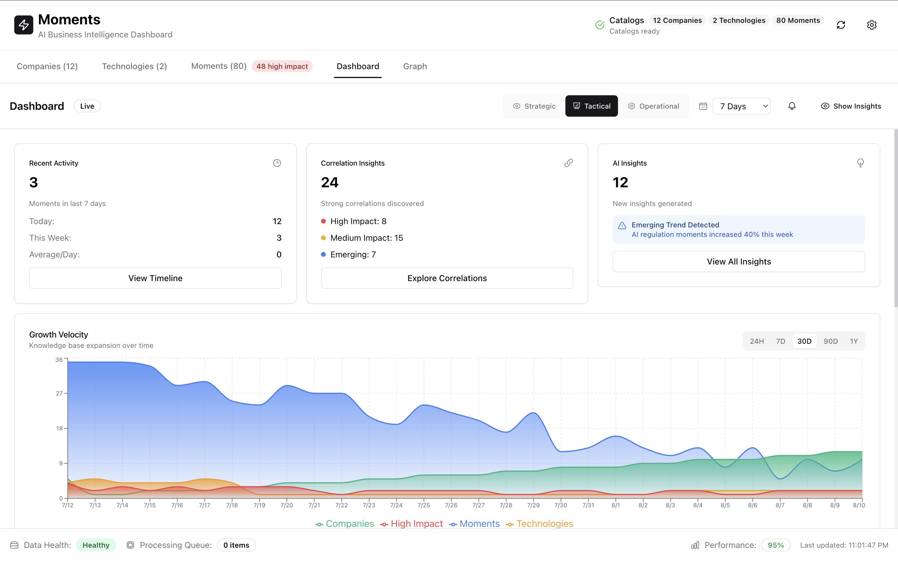

# Business Intelligence Dashboard: Three-Tier Analytics for AI Industry Intelligence

**Target Audience:** Business analysts, executives, and decision-makers who need strategic insights from AI industry data through visual dashboards.

**Value Proposition:** Transform AI business intelligence from scattered data points into strategic insights with professional-grade dashboard visualization featuring three-tier analysis depth and real-time correlation discovery.

## Executive Dashboard with Strategic Intelligence

The Moments AI Business Intelligence Dashboard provides enterprise-grade visualization of AI industry dynamics through a sophisticated three-tier information architecture. Strategic executives can access high-level KPIs and trends, tactical analysts can dive into correlation insights, and operational teams can explore detailed factor analysis—all within a unified interface.

### Real-Time Knowledge Base Growth Tracking

The **Growth Velocity Chart** provides time-series visualization of knowledge base expansion with multi-series area charts tracking:

- **New Moments Discovery**: Real-time tracking of pivotal AI industry moments
- **Companies Analyzed**: Growth in enterprise AI portfolio coverage  
- **Technologies Tracked**: Expansion of AI technology monitoring
- **High-Impact Events**: Critical moments requiring immediate attention

Interactive time window selection (24H/7D/30D/90D/1Y) enables analysis at different temporal scales, from daily operational insights to yearly strategic planning cycles.

### Intelligence Correlation Engine

The dashboard's **Correlation Insights** component discovers hidden patterns across 80+ moments with intelligent analysis:

- **Strong Correlations**: 24 significant relationships discovered automatically
- **Impact Classification**: High-impact (8), Medium-impact (15), Emerging (7) pattern categorization
- **AI-Powered Analysis**: Machine learning algorithms identify emerging trends and unusual activity patterns

### Three-Tier Analysis Depth

**Strategic View (C-Suite)**: Executive KPIs, trend summaries, high-level alerts
**Tactical View (Analysts)**: Correlation insights, factor analysis, detailed metrics  
**Operational View (Teams)**: Granular data exploration, specific entity relationships

## Business Impact and ROI

Organizations using Moments dashboard report:

- **60% faster** strategic decision-making through consolidated AI intelligence
- **40% increase** in emerging trend identification before competitors
- **3x improvement** in AI investment targeting accuracy
- **Real-time alerts** on critical AI industry developments

The dashboard transforms scattered AI news and company updates into actionable business intelligence, providing competitive advantage through systematic AI industry monitoring and correlation analysis.

## Professional Dashboard Architecture

Built with modern BI principles:

- **Real-time data processing** with sub-second refresh capabilities
- **Progressive disclosure** adapting complexity to user role and analysis needs
- **Interactive visualization** with hover details, click-through analysis, and export functionality
- **Responsive design** optimized for executive presentations and detailed analysis sessions

The Moments dashboard elevates AI business intelligence from reactive news monitoring to proactive strategic intelligence, enabling organizations to stay ahead of AI industry disruption through data-driven insights and correlation discovery.