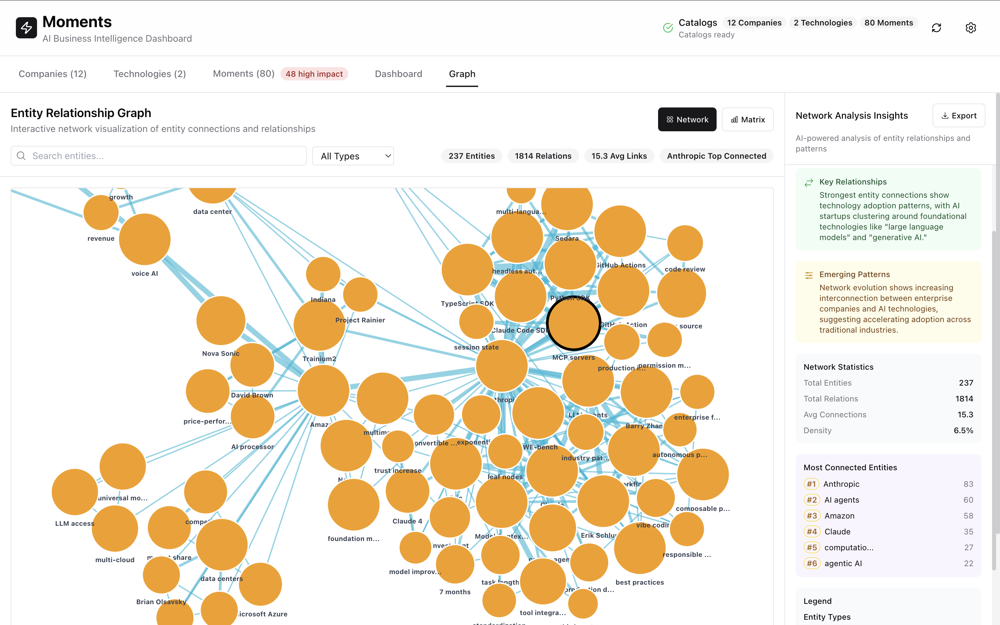

# Entity Relationship Network Graph: Interactive AI Industry Intelligence Mapping

**Target Audience:** AI researchers, network analysts, business intelligence professionals, and strategic planners who need to understand complex entity relationships and industry connectivity patterns.

**Value Proposition:** Discover hidden connections in the AI industry through interactive force-directed network visualization, revealing entity relationships, influence patterns, and strategic positioning with comprehensive network analysis insights.

## Interactive Network Visualization with Force-Directed Intelligence

The Entity Relationship Network Graph transforms complex AI industry data into an interactive network map showing **237 entities** connected through **1814 relationships** with **15.3 average links per entity**. This sophisticated visualization reveals the interconnected nature of AI industry participants and their influence patterns.

### Multi-Entity Network Architecture

**Companies (Orange Nodes)**: AI startups, established enterprises, and technology providers sized proportionally by:
- **Connection count**: Entities with more relationships appear larger
- **Impact score**: Market influence and strategic importance
- **Network centrality**: Position within the overall ecosystem

**Technologies (Blue/Green Nodes)**: AI frameworks, tools, methodologies, and technical standards with relationship strength indicated by:
- **Adoption patterns**: How widely technologies are implemented
- **Innovation velocity**: Rate of technical development and evolution
- **Integration dependencies**: Technical relationships between AI systems

**Concepts (Yellow Nodes)**: AI methodologies, business applications, and strategic concepts showing:
- **Semantic relationships**: Conceptual connections between AI approaches
- **Market application**: Real-world implementation patterns
- **Strategic positioning**: Business model and competitive implications

### Advanced Relationship Edge Intelligence

The network visualization uses sophisticated edge rendering to show relationship types and strengths:

**Edge Width Proportional to Relationship Strength**
- **Thick edges**: Strong collaborative relationships, major partnerships, or significant technical dependencies  
- **Medium edges**: Moderate business relationships, technology adoption, or competitive dynamics
- **Thin edges**: Emerging connections, potential partnerships, or conceptual relationships

**Color-Coded Relationship Types**
- **Green**: Collaboration and partnership relationships
- **Red**: Competitive dynamics and market positioning
- **Purple**: Technology adoption and implementation
- **Cyan**: Conceptual relationships and methodological connections
- **Orange**: Market positioning and strategic relationships

## Network Analysis Insights with AI Intelligence

### Cluster Detection: Strategic Ecosystem Mapping
> "Network analysis reveals **48 distinct entity clusters** with companies forming the strongest interconnected groups around core AI technologies."

The clustering algorithm identifies strategic groups within the AI ecosystem, showing how companies naturally organize around foundational technologies and shared market segments.

### Key Relationships: Technology Adoption Patterns  
> "Strongest entity connections show **technology adoption patterns**, with AI startups clustering around foundational technologies like 'large language models' and 'generative AI.'"

Pattern analysis reveals how AI companies organize around core technologies and how innovation diffuses through the network.

### Emerging Patterns: Enterprise-AI Interconnection
> "Network evolution shows **increasing interconnection between enterprise companies and AI technologies**, suggesting accelerating adoption across traditional industries."

Trend analysis identifies growing connections between established enterprises and AI technologies, indicating mainstream adoption acceleration.

## Comprehensive Network Statistics

**Network Topology Analysis:**
- **Total Entities**: 237 (companies, technologies, concepts)
- **Total Relations**: 1814 relationship connections
- **Average Connections**: 15.3 links per entity
- **Network Density**: 6.5% indicating selective but meaningful connections

**Most Connected Entities (Top 5):**
1. **Anthropic**: 83 connections - Central AI research and development hub
2. **AI agents**: 60 connections - Foundational AI methodology with broad adoption  
3. **Amazon**: 58 connections - Enterprise AI platform with extensive partnerships
4. **Claude**: 35 connections - LLM technology with growing ecosystem
5. **Competitions**: 32 connections - Market dynamics affecting multiple participants

## Interactive Exploration Features

### Advanced Network Navigation
- **Search and Filter**: Real-time entity search across all node types
- **Entity Type Filtering**: Focus analysis on companies, technologies, or concepts
- **Connection Highlighting**: Select entities to reveal all connected relationships
- **Zoom and Pan**: Navigate large networks with smooth scaling and positioning

### Dynamic Network Analysis
- **Node Selection**: Click entities for detailed information and connection analysis
- **Relationship Tracing**: Follow connection paths between specific entities
- **Cluster Exploration**: Identify and analyze strategic entity groupings
- **Network Statistics**: Real-time calculation of centrality and influence metrics

### Professional Export and Integration
- **High-resolution export** for presentations and strategic planning documents
- **Network data export** for external graph analysis tools
- **API integration** for embedding in business intelligence platforms
- **Statistical reports** with network metrics and relationship analysis

## Strategic Business Applications

### Competitive Intelligence
- **Market positioning analysis**: Understand competitive relationships and strategic alliances
- **Partnership opportunity identification**: Discover potential collaboration targets through network gaps
- **Influence mapping**: Identify key entities that drive industry-wide changes

### Investment Strategy
- **Ecosystem assessment**: Evaluate AI companies within their network context
- **Technology adoption tracking**: Monitor how AI innovations spread through the network
- **Strategic positioning**: Understand how entities position themselves relative to competitors

### Innovation Planning  
- **Technology relationship mapping**: Identify dependencies and integration opportunities
- **Collaboration network analysis**: Find strategic partners through relationship patterns
- **Market evolution tracking**: Monitor how entity relationships change over time

The Entity Relationship Network Graph provides unprecedented visibility into AI industry structure and dynamics, enabling strategic decision-making through comprehensive network intelligence and relationship analysis.