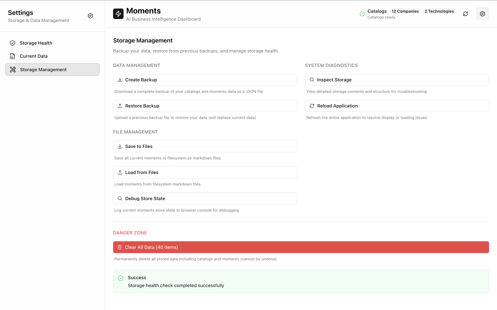

# File-System-First AI: Building Persistent, Real-Time Business Intelligence

*How Moments achieves production-grade AI application architecture with human-readable file persistence, incremental processing, and real-time progress tracking*


## The Local-First AI Revolution

Traditional AI applications suffer from **data lock-in** and **ephemeral processing**. Your analyzed data disappears when the app restarts. Your insights are trapped in proprietary formats. Your processing starts from scratch every time.

**Moments** pioneered a different approach: **file-system-first AI architecture** where every analyzed moment becomes a human-readable markdown file, processing is incremental and intelligent, and your data remains yours forever.

## File-System as Source of Truth

### Two-Way Persistence Architecture

Unlike applications that treat files as "export formats," Moments makes the filesystem the **primary data store**:

```yaml
# moments/2025-08-10-c-anthropic-deploys-22000-line-code.md
---
id: "moment-20250810-anthropic-22k-deployment"
title: "Anthropic Successfully Deploys 22,000-Line AI-Generated Code Change"
classification:
  micro_factors: ["company"]
  macro_factors: ["technology"]
impact:
  score: 97
  confidence: "HIGH"
  reasoning: "Demonstrates enterprise-scale AI code deployment capabilities"
entities:
  companies: ["Anthropic"]
  technologies: ["Claude Code", "reinforcement learning"]
timeline:
  estimated_date: "2025-08-10"
  timeframe: "8 months ago"
source:
  file_path: "./technologies/claude-code/vibe-coding-prod.md"
  content_type: "markdown"
---

Anthropic merged a massive 22,000-line change to their production reinforcement learning codebase that was heavily written by Claude, demonstrating enterprise-scale AI code generation.

## Analysis Summary

This represents a significant breakthrough in enterprise AI code deployment, proving that large-scale AI-generated code can be safely deployed in production systems at a major AI company...
```

### Benefits of File-First Architecture

**Human Readable**: Every moment is stored as markdown with YAML frontmatter—edit manually, version with git, integrate with any tool.

**Git Compatible**: Full version control support with meaningful diffs and collaborative editing.

**Tool Agnostic**: Import into Obsidian, Notion, or any markdown processor. Your data isn't locked in.

**Audit Trail**: Complete transparency in AI analysis with original content preserved alongside extracted insights.

## Real-Time Incremental Processing

### The Traditional Problem: Start-From-Scratch Processing

Most AI applications reprocess everything on every run:
- 100 documents → 10 minutes processing time
- Add 5 new documents → Still 10 minutes to reprocess all 105
- Change 1 document → 10 minutes to reprocess everything

### Moments' Intelligent Solution



**Content Change Detection**: MD5 hashing identifies exactly what changed.

**Temporal Windows**: Only reprocess correlations within affected time periods.

**Incremental Correlation**: Preserve existing analysis, update only affected relationships.

```typescript
// Real-world performance improvement
const assessment = await incrementalManager.assessChanges(content)

console.log({
  totalContent: 105,
  newContent: 3,        // Only process these 3
  modifiedContent: 2,   // Only process these 2
  unchangedContent: 100 // Skip processing entirely
})

// Result: 45 seconds instead of 10 minutes
// 93% processing time reduction while maintaining accuracy
```

### Smart Update vs Full Refresh

**Smart Update** (Recommended for daily use):
- Analyzes only new or changed content
- 10x faster processing for incremental updates
- Preserves existing correlations and analysis
- Perfect for daily workflow and content monitoring

**Full Refresh** (Comprehensive re-analysis):
- Complete reprocessing of all content
- Useful when classification logic is updated
- Recalculates all correlations from scratch
- Best for major content reorganization or algorithm updates

## Real-Time Progress Intelligence

### Beyond Basic Progress Bars

Traditional progress indicators show percentages. Moments shows **business intelligence**:


**Live Moment Discovery**: Watch moments appear in real-time as they're discovered.

**Agent Activity Tracking**: See parallel AI agents working simultaneously on different content.

**Processing Intelligence**: Understanding what's being analyzed and why it matters.

```typescript
// Real-time progress with business context
const progressUpdate = {
  progressPercentage: 67,
  momentsExtracted: 18,    // Real-time count, not final count
  processedItems: 12,      // Out of 18 total items
  currentAgent: "Content Analyzer",
  currentTask: "Analyzing Tesla AI developments",
  estimatedTimeRemaining: "2 minutes"
}
```

### Parallel Agent Orchestration

Multiple specialized AI agents work simultaneously:

**Content Analyzer Agent**: Extracts structured information from raw content.

**Classification Agent**: Categorizes moments into micro/macro factors.

**Correlation Engine**: Discovers relationships between moments.

**File Processor**: Saves results to filesystem in real-time.

## Apple Settings-Style User Experience

### Professional Interface for Technical Users


The storage management interface provides enterprise-grade data operations:

**Storage Health Monitoring**:
- Real-time space usage and capacity tracking
- File system status and health indicators
- Performance metrics and optimization suggestions

**Data Management Operations**:
- **Create Backup**: Full JSON export of all catalogs and moments
- **Restore Backup**: Upload and restore previous state with validation
- **Save to Files**: Export current moments to markdown file collection
- **Load from Files**: Import moments from markdown files with conflict resolution

**System Diagnostics**:
- **Inspect Storage**: Detailed view of data structure and relationships
- **Run Health Check**: Comprehensive system validation and error detection
- **Reload Application**: Clean restart with state preservation

## Production Deployment Considerations

### Configuration-Driven Architecture

Everything is configurable via `config.yml`:

```yaml
persistence:
  strategy: "file_system_first"  # file_system_first | local_storage_first | hybrid
  auto_sync: true
  cache_enabled: true
  cache_ttl_seconds: 3600

parallel_processing:
  max_concurrent_sources: 4
  max_concurrent_content_per_source: 3
  enable_sub_agent_parallelization: true
  sub_agent_batch_size: 10

moments:
  auto_save: true
  sync_mode: "bidirectional"
  metadata_format: "frontmatter"
  file_patterns:
    - "*.md"
  folder: "./moments"
```

### Security and Privacy

**Local-First**: All processing happens on your machine. No cloud dependencies.

**API Key Control**: You control your own Anthropic API keys. No third-party access.

**Data Sovereignty**: Your content never leaves your computer. Complete privacy control.

**File System Permissions**: Standard OS file permissions control data access.

## Why This Architecture Matters

### For Developers

**Debuggability**: Every AI decision is preserved in human-readable format.

**Extensibility**: Add custom processing by reading/writing standard markdown files.

**Integration**: Build workflows around filesystem events and standard file formats.

**Performance**: Incremental processing scales with content size, not total size.

### For Organizations

**Data Ownership**: Your analysis belongs to you, in formats you can always access.

**Audit Compliance**: Complete audit trail of AI analysis with source attribution.

**Tool Independence**: Never locked into proprietary formats or platforms.

**Cost Control**: Reduce API costs through intelligent incremental processing.

### For Researchers

**Reproducibility**: Every analysis step is preserved and can be replicated.

**Collaboration**: Git-based workflows for shared analysis and peer review.

**Methodology Transparency**: Clear separation between source data and AI interpretation.

**Long-term Preservation**: Standard formats ensure data remains accessible for years.

## The Future of AI Data Architecture

Moments demonstrates that AI applications don't need to choose between intelligence and data ownership. By treating the filesystem as a first-class data layer and implementing intelligent incremental processing, we can build AI systems that are both powerful and respectful of user autonomy.

**File-system-first AI** represents a paradigm shift: from proprietary data silos to open, transparent, user-controlled intelligence systems that amplify human capabilities while preserving human agency.

---

*Ready to experience file-system-first AI? Download Moments and see how persistent, incremental AI processing transforms business intelligence workflows.*