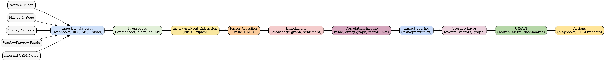

# Moments App Architecture & Operational Framework

## 1. Overview
The **Moments App** discovers and correlates pivotal moments in the AI industry as they apply to top 100 most valued AI startups and Fortune 100 enterprises managing AI-driven disruption.

It creates **signal from noise** by classifying and correlating these pivotal moments around:
- **Micro factors**: company, competition, partners, customer
- **Macro factors**: economic, geo-political, regulation, technology, environment, supply chain

---

## 2. Architecture Diagram


---

## 3. Pipeline Stages

### **Sources**
- News & Blogs
- Filings & Regulations
- Social Media & Podcasts
- Vendor/Partner Feeds
- Internal CRM/Notes

### **Ingestion Gateway**
- Webhooks, RSS feeds, APIs, file uploads
- Deduplication via URL hashing + shingling

### **Preprocessing**
- Language detection & translation
- HTML → text normalization
- Text cleaning & chunking
- Embedding generation

### **Entity & Event Extraction**
- Named Entity Recognition (companies, people, products, locations, regulations, technologies)
- Event triples: `(actor, action, object, qualifiers, time)`

### **Factor Classifier (Hybrid)**
- **Rule-based matching** for high-confidence keywords & patterns
- **ML classifier** fine-tuned on labeled “pivotal moment” datasets
- Outputs:
  ```json
  {
    "factor_type": "micro",
    "factor_category": "M&A",
    "confidence": 0.92
  }
  ```

### **Enrichment**
- Join events to internal **Knowledge Graph** (companies, competitors, partners, suppliers, regulations, technologies)
- Historical analogs for context
- Sentiment analysis & stance detection

### **Correlation Engine**
- **Temporal correlation**: group related events in a defined time window
- **Entity graph correlation**: shared entities or dependencies
- **Factor cross-linking**: link macro events to micro reactions

### **Impact Scoring**
Weighted formula:
```
Impact Score = (Breadth * 0.25) + (Depth * 0.30) + (Urgency * 0.20) + (Momentum * 0.15) + (Strategic Fit * 0.10)
```
- Breadth: # of unique entities/markets affected
- Depth: potential financial or operational impact
- Urgency: regulatory deadlines, competitive advantage
- Momentum: velocity of mentions in media
- Strategic Fit: match with user-defined watchlists

### **Storage Layer**
- **Events**: PostgreSQL
- **Vectors**: pgvector / OpenSearch
- **Graph**: Neo4j / AWS Neptune
- **Blobs**: S3

### **UX/API**
- Search: keyword, vector, filters
- Alerts: real-time triggers based on score thresholds
- Dashboards: heatmaps, timelines, trendlines

### **Actions**
- Playbooks: pre-defined response workflows
- CRM updates: push to Salesforce, HubSpot, etc.
- Automated brief generation

---

## 4. Data Model

**Event Schema**
```json
{
  "event_id": "EVT-123",
  "timestamp": "2025-08-09T14:35:00Z",
  "source": {"url": "...", "publisher": "..."},
  "text_span": {"start": 204, "end": 812},
  "entities": [{"type":"company","name":"Acme AI"}],
  "event_triple": {"actor":"Acme AI","action":"acquires","object":"ChipCo"},
  "factors": [{"type":"micro","category":"M&A","confidence":0.92}],
  "hash": "..."
}
```

**Moment Schema**
```json
{
  "moment_id":"MNT-001",
  "time_window":{"start":"...","end":"..."},
  "micro_factors":["M&A","Partnerships"],
  "macro_factors":["Regulatory: Privacy"],
  "entities":["Acme AI","ChipCo","EU"],
  "impact":{"risk":22,"opportunity":81,"composite":86},
  "members":["EVT-1","EVT-7","EVT-9"]
}
```

---

## 5. Operational Guardrails
- Deduplication and contradiction checks
- Model drift monitoring (weekly F1 score evaluation)
- Explainability: store key sentences for each classification
- Compliance with robots.txt and data licensing

---

## 6. MVP Stack Recommendations
- **Ingestion**: Airbyte / custom webhook service
- **Processing**: Python workers (Celery or Temporal), Bedrock + Claude for NER
- **Storage**: PostgreSQL + pgvector, S3 for raw data, Neo4j for graph
- **Search**: OpenSearch Lite or Postgres trigram + vector hybrid
- **Alerts**: Slack/Email via rule-based engine

---

*Last updated: 2025-08-09*
